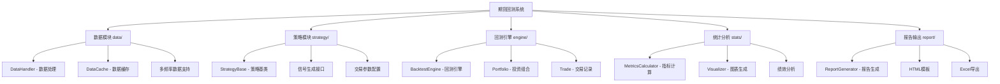
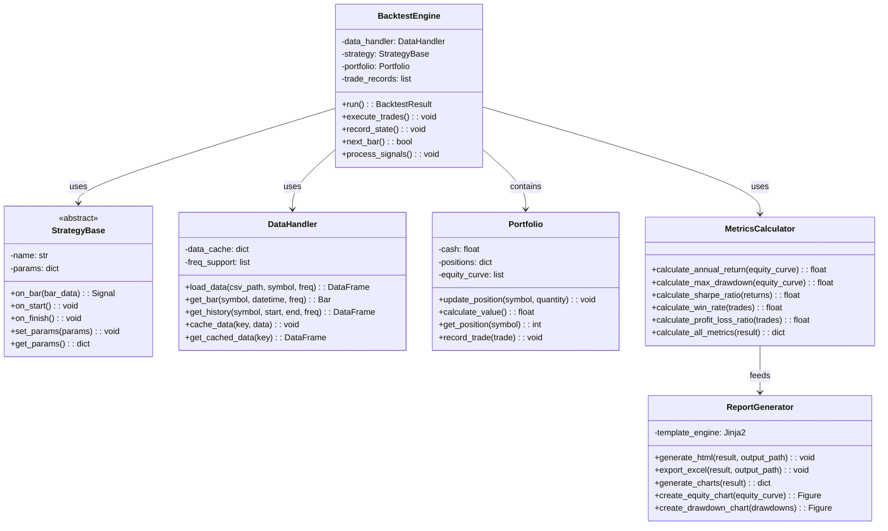

# 期货回测系统基础框架代码实施规划

## 📋 项目概述

基于设计文档和接口设计，生成完整的期货回测系统基础框架代码，包含数据模块、策略模块、回测引擎、统计分析和报告输出等五大核心模块。

## 🏗️ 系统架构设计

### 模块依赖关系图



### 核心类设计



## 📁 详细文件结构

```
pyfback/
├── requirements.txt                 # 项目依赖包
├── setup.py                        # 安装配置
├── README.md                       # 项目说明文档
├── config.py                       # 全局配置文件
├── data/                           # 数据模块
│   ├── __init__.py
│   ├── data_handler.py            # 数据处理主类
│   ├── data_cache.py              # 数据缓存机制
│   ├── bar.py                     # K线数据结构
│   └── utils.py                   # 数据处理工具函数
├── strategy/                       # 策略模块
│   ├── __init__.py
│   ├── base.py                    # 策略基类
│   ├── signals.py                 # 交易信号类
│   ├── position.py                # 持仓管理
│   └── examples/                  # 示例策略
│       ├── __init__.py
│       ├── moving_average.py      # 移动平均策略
│       └── dual_thrust.py         # 双推力策略
├── engine/                         # 回测引擎
│   ├── __init__.py
│   ├── backtest_engine.py         # 回测引擎主类
│   ├── portfolio.py               # 投资组合管理
│   ├── trade.py                   # 交易记录类
│   ├── execution.py               # 交易执行逻辑
│   └── events.py                  # 事件驱动系统
├── stats/                          # 统计分析模块
│   ├── __init__.py
│   ├── metrics.py                 # 绩效指标计算
│   ├── visualizer.py              # 图表生成
│   ├── risk_analysis.py           # 风险分析
│   └── utils.py                   # 统计工具函数
├── report/                         # 报告输出模块
│   ├── __init__.py
│   ├── generator.py               # 报告生成主类
│   ├── templates/                 # HTML模板目录
│   │   ├── base.html
│   │   └── backtest_report.html
│   ├── excel_exporter.py          # Excel导出器
│   └── chart_factory.py           # 图表工厂类
├── examples/                       # 使用示例
│   ├── __init__.py
│   ├── simple_backtest.py         # 简单回测示例
│   ├── advanced_strategy.py       # 高级策略示例
│   └── sample_data/               # 示例数据
│       └── sample_futures.csv
├── tests/                          # 单元测试
│   ├── __init__.py
│   ├── test_data.py
│   ├── test_strategy.py
│   ├── test_engine.py
│   ├── test_stats.py
│   └── test_report.py
└── docs/                          # 已存在的文档目录
    ├── design.md
    └── interface.pdf
```

## 🔧 技术栈与依赖包

### 核心依赖包

```txt
# 数据处理（高性能）
pandas>=1.5.0
polars>=0.20.0
numpy>=1.24.0

# 数值计算加速
numba>=0.58.0

# 可视化
matplotlib>=3.6.0
plotly>=5.17.0
seaborn>=0.12.0

# 报告生成
jinja2>=3.1.0
xlsxwriter>=3.0.0
weasyprint>=59.0

# 数据格式支持
pyarrow>=10.0.0
h5py>=3.8.0

# 开发工具
pytest>=7.2.0
black>=23.0.0
isort>=5.12.0
```

### 可选增强包

```txt
# 更多数据源
tushare>=1.2.0
yfinance>=0.2.0

# 机器学习（用于高级策略）
scikit-learn>=1.3.0

# 并行计算
joblib>=1.3.0
dask>=2023.1.0

# 更多图表类型
bokeh>=3.0.0
pyecharts>=2.0.0
```

## 📋 核心类接口设计

### 1. 数据模块 (data/)

#### DataHandler类
```python
class DataHandler:
    """数据处理主类，支持多频率K线数据加载和缓存"""
    
    def __init__(self, cache_enabled: bool = True):
        """初始化数据处理器"""
    
    def load_data(self, csv_path: str, symbol: str, freq: str) -> pl.DataFrame:
        """从CSV加载历史数据"""
    
    def get_bar(self, symbol: str, datetime: dt.datetime, freq: str) -> Bar:
        """获取指定时间点的K线数据"""
    
    def get_history(self, symbol: str, start: dt.datetime, 
                   end: dt.datetime, freq: str) -> pl.DataFrame:
        """获取历史数据序列"""
    
    def cache_data(self, key: str, data: pl.DataFrame) -> None:
        """缓存数据到内存"""
    
    def get_cached_data(self, key: str) -> Optional[pl.DataFrame]:
        """从缓存获取数据"""
```

#### Bar数据结构
```python
@dataclass
class Bar:
    """K线数据结构"""
    symbol: str
    datetime: dt.datetime
    open: float
    high: float
    low: float
    close: float
    volume: int
    open_interest: int
```

### 2. 策略模块 (strategy/)

#### StrategyBase基类
```python
class StrategyBase(ABC):
    """策略基类，所有策略都应继承此类"""
    
    def __init__(self, name: str, params: Dict[str, Any] = None):
        """初始化策略"""
    
    @abstractmethod
    def on_bar(self, bar: Bar) -> Optional[Signal]:
        """处理新K线数据，返回交易信号"""
    
    def on_start(self) -> None:
        """回测开始前的初始化"""
    
    def on_finish(self) -> None:
        """回测结束后的清理"""
    
    def set_params(self, params: Dict[str, Any]) -> None:
        """设置策略参数"""
    
    def get_params(self) -> Dict[str, Any]:
        """获取策略参数"""
```

#### Signal信号类
```python
@dataclass
class Signal:
    """交易信号数据结构"""
    symbol: str
    direction: int  # 1:买入, -1:卖出, 0:平仓
    quantity: int
    price_type: str  # 'market', 'limit'
    limit_price: Optional[float] = None
    timestamp: dt.datetime = field(default_factory=dt.datetime.now)
```

### 3. 回测引擎 (engine/)

#### BacktestEngine主类
```python
class BacktestEngine:
    """回测引擎主类，协调整个回测流程"""
    
    def __init__(self, data_handler: DataHandler, strategy: StrategyBase,
                 initial_capital: float = 1000000, 
                 commission: float = 0.0001,
                 slippage: float = 0.0001):
        """初始化回测引擎"""
    
    def run(self, symbol: str, start_date: dt.datetime, 
            end_date: dt.datetime, freq: str = '1min') -> BacktestResult:
        """运行回测"""
    
    def execute_trades(self, signals: List[Signal]) -> None:
        """执行交易信号"""
    
    def record_state(self) -> None:
        """记录当前回测状态"""
    
    def next_bar(self) -> bool:
        """推进到下一个K线"""
```

#### Portfolio投资组合类
```python
class Portfolio:
    """投资组合管理类"""
    
    def __init__(self, initial_capital: float):
        """初始化投资组合"""
    
    def update_position(self, symbol: str, quantity: int, price: float) -> None:
        """更新持仓"""
    
    def calculate_value(self, current_prices: Dict[str, float]) -> float:
        """计算当前总价值"""
    
    def get_position(self, symbol: str) -> int:
        """获取指定标的持仓"""
    
    def record_trade(self, trade: Trade) -> None:
        """记录交易"""
```

### 4. 统计分析模块 (stats/)

#### MetricsCalculator绩效计算类
```python
class MetricsCalculator:
    """绩效指标计算类"""
    
    @staticmethod
    def calculate_annual_return(equity_curve: List[float], 
                              trading_days: int = 252) -> float:
        """计算年化收益率"""
    
    @staticmethod
    def calculate_max_drawdown(equity_curve: List[float]) -> Dict[str, float]:
        """计算最大回撤"""
    
    @staticmethod
    def calculate_sharpe_ratio(returns: List[float], 
                             risk_free_rate: float = 0.0) -> float:
        """计算夏普比率"""
    
    @staticmethod
    def calculate_win_rate(trades: List[Trade]) -> float:
        """计算胜率"""
    
    @staticmethod
    def calculate_profit_loss_ratio(trades: List[Trade]) -> float:
        """计算盈亏比"""
    
    @classmethod
    def calculate_all_metrics(cls, result: BacktestResult) -> Dict[str, float]:
        """计算所有绩效指标"""
```

#### Visualizer图表生成类
```python
class Visualizer:
    """图表生成类，支持matplotlib和plotly"""
    
    def __init__(self, backend: str = 'plotly'):
        """初始化可视化器"""
    
    def create_equity_curve(self, equity_data: List[float], 
                           dates: List[dt.datetime]) -> Figure:
        """创建权益曲线图"""
    
    def create_drawdown_chart(self, drawdown_data: List[float],
                             dates: List[dt.datetime]) -> Figure:
        """创建回撤曲线图"""
    
    def create_position_chart(self, position_data: List[int],
                             dates: List[dt.datetime]) -> Figure:
        """创建持仓变化图"""
    
    def create_trade_distribution(self, trades: List[Trade]) -> Figure:
        """创建交易分布图"""
```

### 5. 报告输出模块 (report/)

#### ReportGenerator报告生成类
```python
class ReportGenerator:
    """报告生成主类，支持HTML和Excel输出"""
    
    def __init__(self, template_dir: str = 'report/templates'):
        """初始化报告生成器"""
    
    def generate_html(self, result: BacktestResult, 
                     output_path: str) -> None:
        """生成HTML报告"""
    
    def export_excel(self, result: BacktestResult, 
                    output_path: str) -> None:
        """导出Excel报告"""
    
    def generate_charts(self, result: BacktestResult) -> Dict[str, Figure]:
        """生成所有图表"""
    
    def _prepare_template_data(self, result: BacktestResult) -> Dict[str, Any]:
        """准备模板数据"""
```

## 🚀 实施步骤

### 第一阶段：项目基础设置
1. 创建项目配置文件（requirements.txt, setup.py, config.py）
2. 创建各模块的__init__.py文件
3. 创建基础的数据结构类（Bar, Signal, Trade等）

### 第二阶段：核心模块实现
1. 实现数据模块（DataHandler, DataCache）
2. 实现策略模块（StrategyBase, 示例策略）
3. 实现回测引擎（BacktestEngine, Portfolio）

### 第三阶段：分析与报告
1. 实现统计分析模块（MetricsCalculator, Visualizer）
2. 实现报告生成模块（ReportGenerator, 模板）
3. 创建使用示例和测试用例

### 第四阶段：完善与优化
1. 添加单元测试
2. 性能优化（numba加速）
3. 文档完善

## 🎯 性能优化策略

### 使用Polars提升数据处理性能
- 替代pandas进行大规模数据操作
- 利用lazy evaluation延迟计算
- 并行处理多个合约数据

### 使用Numba加速关键计算
- JIT编译回测循环核心逻辑
- 加速指标计算函数
- 优化向量化操作

### 使用Plotly增强可视化
- 交互式图表提升用户体验
- 支持大规模数据点渲染
- 便于Web界面集成

## 📊 示例使用代码

```python
# 简单回测示例
from data import DataHandler
from strategy.examples import MovingAverageStrategy
from engine import BacktestEngine
from stats import MetricsCalculator, Visualizer
from report import ReportGenerator

# 初始化组件
data_handler = DataHandler()
strategy = MovingAverageStrategy(fast_period=5, slow_period=20)
engine = BacktestEngine(data_handler, strategy, initial_capital=1000000)

# 运行回测
result = engine.run(
    symbol='IH2312', 
    start_date=datetime(2023, 1, 1),
    end_date=datetime(2023, 12, 31),
    freq='1min'
)

# 计算绩效指标
metrics = MetricsCalculator.calculate_all_metrics(result)
print(f"年化收益率: {metrics['annual_return']:.2%}")
print(f"最大回撤: {metrics['max_drawdown']:.2%}")
print(f"夏普比率: {metrics['sharpe_ratio']:.2f}")

# 生成报告
visualizer = Visualizer(backend='plotly')
report_generator = ReportGenerator()

# 生成HTML报告
report_generator.generate_html(result, 'backtest_report.html')

# 导出Excel明细
report_generator.export_excel(result, 'backtest_details.xlsx')
```

此基础框架设计遵循模块化、可扩展的原则，集成了高性能计算库，能够支持从简单的移动平均策略到复杂的多因子策略的各种回测需求。